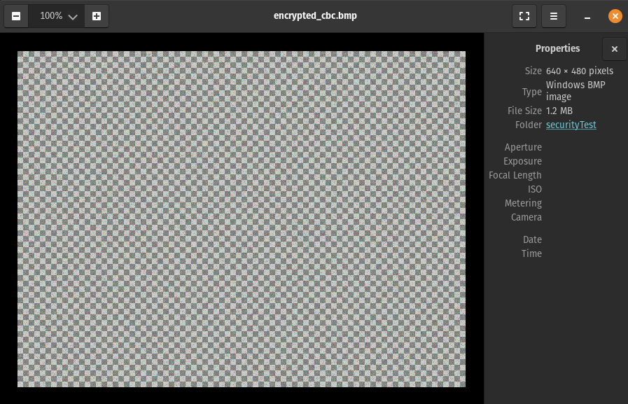

# <p align='center'>Lab 3: Symmetric encryption & hashing<p>

## ✔️ Task 1

### Solution

**Text file:**

```text
Our concept of time begins with the creation of the universe.
Therefore if the laws of nature created the universe, these laws must have existed prior to time; that is the laws of nature would be outside of time.
What we have then is totally non-physical laws, outside of time, creating a universe. Now that description might sound somewhat familiar.
Very much like the biblical concept of God: not physical, outside of time, able to create a universe..
```

**Commands:** <br>
Encrypt using AES-128 in ECB mode:

```bash

openssl enc -aes-128-ecb -e -in plain.txt -out cipher_ecb.bin -K 00112233445566778889aabbccddeeff -iv 4b5e2f5daffc9e3d8b0f4e5e1a234b91

```

Encrypt using AES-128 in CBC mode:

```bash
openssl enc -aes-128-cbc -e -in plain.txt -out cipher_cbc.bin -K $(openssl rand -hex 16) -iv $(openssl rand -hex 16)
```

Encrypt using AES-128 in CFB mode:

```bash
openssl enc -aes-128-cfb -e -in plain.txt -out cipher_cfb.bin -K $(openssl rand -hex 16) -iv $(openssl rand -hex 16)
```

Encrypt using AES-128 in ECB mode:

```bash
openssl enc -aes-128-ecb -e -in plain.txt -out cipher_ecb.bin -K $(openssl rand -hex 16)

```

Encrypt using AES-128 in OFB mode:

```bash
openssl enc -aes-128-ofb -e -in plain.txt -out cipher_ofb.bin -K $(openssl rand -hex 16) -iv $(openssl rand -hex 16)

```

## ✔️ Task 2

### Solution

**Commands:** <br>
Encryption using ECB mode:

```bash
openssl enc -aes-128-ecb -e -in pic_original.bmp -out encrypted_ecb.bmp -K $(openssl rand -hex 16)

```

Encryption using CBC mode:

```bash
openssl enc -aes-128-cbc -e -in pic_original.bmp -out encrypted_cbc.bmp -K $(openssl rand -hex 16)
```

**Output files:** <br>
After replacing the header of the encrypted files with the header of the real image, <br>
I got the following images and it is impossible to see any useful information from the encrypted images. <br>


<br><br>

ECB mode: <br>

<br><br>
CBC mode: <br>


**Observations:** <br>

- In ECB mode, it is possible to recover some information from the encrypted image.
- In CBC mode, it is impossible to recover any information from the encrypted image.

<hr>

## ✔️ Task 3

### Solution

**Text file:** <br>

**Encryption Commands:** <br>
ECB mode:

```bash
openssl enc -aes-128-ecb -e -in plain.txt -out cipher_ecb.bin -K 00112233445566778889aabbccddeeff -iv 0102030405060708

```

CBC mode:

```bash
openssl enc -aes-128-cbc -e -in plain.txt -out cipher_cbc.bin -K 00112233445566778889aabbccddeeff -iv 0102030405060708


```

CFB mode:

```bash
openssl enc -aes-128-cfb -e -in plain.txt -out cipher_cfb.bin -K 00112233445566778889aabbccddeeff -iv 0102030405060708


```

OFB mode:

```bash
openssl enc -aes-128-ofb -e -in plain.txt -out cipher_ofb.bin -K 00112233445566778889aabbccddeeff -iv 01020304050607080000000000000000

```

**Decryption Commands:** <br>
ECB mode:

```bash
openssl enc -aes-128-ecb -e -in plain.txt -out cipher_ecb.bin -K 00112233445566778889aabbccddeeff

````

CBC mode:

```bash
openssl enc -aes-128-cbc -e -in plain.txt -out cipher_cbc.bin -K 00112233445566778889aabbccddeeff -iv 0102030405060708


```

CFB mode:

```bash
openssl enc -aes-128-cfb -e -in plain.txt -out cipher_cfb.bin -K 00112233445566778889aabbccddeeff -iv 0102030405060708


```

OFB mode:

```bash
openssl enc -aes-128-ofb -d -in cipher_ofb.bin -out decrypted_ofb.txt -K 00112233445566778889aabbccddeeff -iv 01020304050607080000000000000000


```

**Decrypted files:** <br>

In the case of ECB mode,

- each block of plaintext is encrypted independently.
- since each block is encrypted separately, the corruption affects only one block.
- as a result, only the corrupted block will be affected, and the rest of the blocks will be decrypted correctly.
- it is possible to recover all information except for the corrupted block.

CBC mode:

In the case of CBC mode,

- each block of plaintext is XORed with the previous ciphertext block before encryption.
- if a single bit of the ciphertext is corrupted, it affects the decryption of the current and subsequent blocks due to error propagation.
- therefore, in CBC mode, only the block where the corruption occurred and all subsequent blocks cannot be recovered.
- The preceding blocks can be recovered correctly.

In the case of CFB mode,

- the ciphertext of the previous block is encrypted and XORed with the current plaintext block to generate the current ciphertext block.
- if a single bit of the ciphertext is corrupted, it affects the decryption of the current block.
- since the encryption process uses the corrupted ciphertext block to generate the subsequent ciphertext blocks, the error propagates to all subsequent blocks.
- as a result, in CFB mode, none of the plaintext blocks after the corrupted block can be recovered.

In the case of OFB mode,

- the key stream is generated independently of the plaintext.
- if a single bit of the ciphertext is corrupted, it does not affect the decryption of subsequent blocks because the key stream is not influenced by the ciphertext.
- therefore, in OFB mode, all plaintext blocks except the corrupted block can be recovered.

<hr>

## ✔️ Task 4

### Solution

Here I tested the previous text files and related all things are attached in the repository of Task4.

**Observations and Explanations:** <br>

- ECB mode requires padding because it encrypts each block independently. If the plaintext size is not a multiple of the block size, padding is needed to fill the last block.
- CBC mode also requires padding for the same reason as ECB. Additionally, CBC mode requires an IV (Initialization Vector) for the XOR operation with the first block, but padding is still needed for the last block.
- CFB mode does not require padding because it operates on a byte level rather than block level. The ciphertext length is the same as the plaintext length.
- OFB mode also does not require padding because it generates a key stream independently of the plaintext. The ciphertext length matches the plaintext length.

<hr>

## ✔️ Task 5

### Solution

**Text file:** <br>

```text
This is a sample text file with sufficient length to be more than 64 bytes long for encryption purposes.

```

**Commands:** <br>

```bash
# MD5
openssl dgst -md5 textfile.txt
MD5(textfile.txt)= ae03a9da1fbedfa8f8e143404c08f2ea
# SHA-256
openssl dgst -sha256 textfile.txt
SHA2-256(textfile.txt)= a650c3f4ec41c556ff153c0a7abce54062e1c380fe38b5912d49144f6c4f338f

# SHA-512
openssl dgst -sha512 textfile.txt
SHA2-512(textfile.txt)= bb1c7821de8ecb82786875d5fec1bc0964c1478bfe630d617009f2d500509a6bc7be6f95adb576bef505c93eb145800d61243c338bf82b3a6db841fb30f56ea9
```

**Observations and Explanations:** <br>

- Hash Length:
  - MD5 produces a 128-bit (16-byte) hash value.
  - SHA-256 produces a 256-bit (32-byte) hash value.
  - SHA-512 produces a 512-bit (64-byte) hash value.
- Security Levels:
  - MD5 is considered weak and vulnerable to collision attacks.
  - SHA-256 and SHA-512 offer stronger security properties and are recommended for security-critical applications.
- Speed:
  - MD5 is faster than SHA-256 and SHA-512.
  - SHA-512 is slower than SHA-256.

<hr>

## ✔️ Task 6

### Solution

**Text file:** <br>

```text
This is a sample text file with sufficient length to be more than 64 bytes long for encryption purposes.
```

**Commands:** <br>
Short key length:

```bash
# HMAC-MD5
openssl dgst -hmac abcdef1234567890 -md5 textfile.txt

# HMAC-SHA256
openssl dgst -hmac abcdef1234567890 -sha256 textfile.txt

# HMAC-SHA1
openssl dgst -hmac abcdef1234567890 -sha1 textfile.txt

```

Long key length:

```bash
# HMAC-MD5
openssl dgst -hmac "this_is_a_longer_secret_key" -md5 textfile.txt

# HMAC-SHA256
openssl dgst -hmac "this_is_a_longer_secret_key" -sha256 textfile.txt

# HMAC-SHA1
openssl dgst -hmac "this_is_a_longer_secret_key" -sha1 textfile.txt
```

**Observations:** <br>
HMAC-MD5:

- Short key: Limited key length increases vulnerability to brute-force attacks.
- Long key: Extended key length strengthens security, mitigating brute-force risks.

HMAC-SHA256:

- Short key: Reduced key size raises susceptibility to brute-force attacks.
- Long key: Expanded key size significantly boosts security.

HMAC-SHA1:

- Short key: Smaller keys are more vulnerable to brute-force attacks despite SHA1's inherent strength.
- Long key: Larger keys enhance security significantly, making brute-force attacks impractical.

## ✔️ Task 7

### Solution

**Text file:** <br>

```textfile2
This is a sample text file1 with sufficient length to be more than 64 bytes long for encryption purposes.
```

```textfile1
This is a sample text file with sufficient length to be more than 64 bytes long for encryption purposes.
```

**Commands:** <br>

```bash
openssl dgst -md5 textfile1.txt
openssl dgst -md5 textfile2.txt
```

```bash
openssl dgst -sha256 textfile1.txt

openssl dgst -sha256 textfile2.txt
```

**Observations:** <br>

- The hash values of H1 and H2 are different.
- After changing the text file, the hash values of H1 and H2 changed.
- H1 uses MD5, while H2 uses SHA-256.
- MD5 produces a 128-bit hash value, while SHA-256 produces a 256-bit hash value.

**Code to calculate same bits:**
**SHAmd5**

```cpp
#include<iostream>
using namespace std;
int main()
{
    string h1 = "ae03a9da1fbedfa8f8e143404c08f2ea";
    string h2 = "43de23f6451cd2568d515415591fef90";
    int differentBits = 0;
    // Assuming h1 and h2 same length cause its from same hash algorithm.
    // every character represented in 8 bits.
    for(int i=0;i<h1.size();i++)
    {
        int h1Ascii = int(h1[i]);
        int h2Ascii = int(h2[i]);
        // xor the two ascii values to find the different bits. and differentBits++ for each 1.
        int xorResult = h1Ascii^h2Ascii;
        while(xorResult>0)
        {
            if(xorResult%2==1)
            {
                differentBits++;
            }
            xorResult/=2;
        }
    }
    cout<<"Number of different bits: "<<differentBits<<endl;
    int sameBits = h1.size()*8-differentBits;
    cout<<"Number of same bits: "<<sameBits<<endl;

}


 //result
// Number of different bits: 90
// Number of same bits: 166
```

**Code to calculate same bits:**
**SHA-256**

```cpp


#include<iostream>
using namespace std;
int main()
{
    string h1 = "a650c3f4ec41c556ff153c0a7abce54062e1c380fe38b5912d49144f6c4f338f";
    string h2 = "d995aa1ec2a04c8bc99a251ebbef7f93af7cde7b58e2399c3a65141fb8da13bf";
    int differentBits = 0;
    // Assuming h1 and h2 same lenght cause its from same hash algorithm.
    // every character represented in 8 bits.
    for(int i=0;i<h1.size();i++)
    {
        int h1Ascii = int(h1[i]);
        int h2Ascii = int(h2[i]);
        // xor the two ascii values to find the different bits. and differentBits++ for each 1.
        int xorResult = h1Ascii^h2Ascii;
        while(xorResult>0)
        {
            if(xorResult%2==1)
            {
                differentBits++;
            }
            xorResult/=2;
        }
    }
    cout<<"Number of different bits: "<<differentBits<<endl;
    int sameBits = h1.size()*8-differentBits;
    cout<<"Number of same bits: "<<sameBits<<endl;

}


 //result
// Number of different bits: 166
// Number of same bits: 346
```

<hr>
